# ML-Numerical-Diabetes-Glucose-ODE-Modeling

<p align="center">
  <a href="" rel="noopener">
    


</p>
<p align="center">
    <br> 
</p>
<div align="center">

[](https://github.com/Ibrahim-Abdelqader/ML-Numerical-Diabetes-Glucose-ODE-Modeling/contributors)
[](https://github.com/Ibrahim-Abdelqader/ML-Numerical-Diabetes-Glucose-ODE-Modeling/issues)
[](https://github.com/Ibrahim-Abdelqader/ML-Numerical-Diabetes-Glucose-ODE-Modeling/network)
[](https://github.com/Ibrahim-Abdelqader/ML-Numerical-Diabetes-Glucose-ODE-Modeling/stargazers)
[](https://github.com/Ibrahim-Abdelqader/ML-Numerical-Diabetes-Glucose-ODE-Modeling/blob/main/LICENSE)

</div>

<details>
  <summary>📚 Table of Contents</summary>
  <ol>
    <li><a href="#about">About The Project</a>
      <ul>
        <li><a href="#-built-using">Built Using</a></li>
      </ul>
    </li>
    <li><a href="#-installation">Installation</a></li>
    <li><a href="#-running-the-notebook">Running the Notebook</a></li>
    <li><a href="#-numerical-methods-for-solving-odes-in-glucose-insulin-modeling">Numerical Methods for Solving ODEs</a></li>
    <li><a href="#-whats-inside">What’s Inside (Methods)</a></li>
    <li><a href="#-key-concepts">Key Concepts (ODE)</a></li>
    <li><a href="#-methods-breakdown">Methods Breakdown</a></li>
    <li><a href="#-physics-informed-neural-network-pinn-for-glucose-insulin-dynamics">PINN for Glucose-Insulin Dynamics</a></li>
    <li><a href="#-description">PINN Description</a></li>
    <li><a href="#-whats-inside-1">What’s Inside (PINN)</a></li>
    <li><a href="#-key-concepts-1">Key Concepts (PINN)</a></li>
    <li><a href="#-cases-modeled">Cases Modeled</a></li>
    <li><a href="#preview-sample-code-snippets">Preview (Sample Code)</a></li>
    <li><a href="#technologies-used">Technologies Used</a></li>
    <li><a href="#-output-of-pinn">Output of PINN</a></li>
    <li><a href="#-output-of-methods">Output of Methods</a></li>
    <li><a href="#-citation">Citation</a></li>
    <li><a href="#contributors">Contributors</a></li>
  </ol>
</details>


## About
a various numerical methods for solving ode's and machine-learning schemes .
* <a href =  "https://www.canva.com/design/DAGq1cX-lsk/ITrioljMl9J9iHpE72KnxQ/edit"  />Presentation</a>
## 💻 Built Using 
* 
* 
* 
* 
* 


---

## 📦 Installation

#### 1. Clone the Repository
```bash
git clone https://github.com/Ibrahim-Abdelqader/ML-Numerical-Diabetes-Glucose-ODE-Modeling.git
cd pinn-glucose-model
```

#### 2. Create a Virtual Environment (Optional but Recommended)
```bash
python -m venv venv
source venv/bin/activate  # On Windows use `venv\Scripts\activate`
```

#### 3. Install Required Packages
```bash
pip install -r requirements.txt
```

> If `requirements.txt` is missing, use:
```bash
pip install tensorflow numpy matplotlib scipy
```

### 🧪 Running the Notebook

1. Launch Jupyter:
```bash
jupyter notebook
```

2. Open `PINN.ipynb` in your browser.

3. Run all cells to train the model and visualize glucose-insulin dynamics.

---


# 📘 Numerical Methods for Solving ODEs in Glucose-Insulin Modeling 
This notebook implements and compares **five numerical methods** for solving systems of ordinary differential equations (ODEs) in the context of **glucose-insulin dynamics**. Each method is applied to a system of biological ODEs with time-varying input and conditional behavior.

---
## 🚀 What's Inside?
<table>
  <thead>
    <tr>
      <th>Method</th>
      <th>Description</th>
      <th>Book</th>
    </tr>
  </thead>
  <tbody>
    <tr>
      <td>ISODA</td>
      <td>A stiff ODE solver using adaptive step-size control and automatic method switching (e.g., BDF and Adams). Often used in real-world stiff ODE systems.</td>
      <td>✅</td>
    </tr>
	     <tr>
      <td>Classical 4th-order Runge-Kutta method</td>
      <td>Widely used, fixed-step solver. Computes intermediate slopes (k1–k4) to estimate the solution with good accuracy.</td>
      <td>✅</td>
    </tr>
    <tr>
      <td>Newton-Raphson with Backward Euler</td>
      <td>A first-order implicit method solving nonlinear equations at each step using Newton-Raphson. Very stable for stiff problems but requires Jacobian.</td>
      <td>❌</td>
    </tr>
    <tr>
      <td>Trapezoidal</td>
      <td>An implicit method averaging the slope at the current and next time steps. It’s A-stable and more suited for moderately stiff problems.</td>
      <td>❌</td>
    </tr>
 
<tr>
      <td>Midpoint</td>
      <td>A second-order explicit method that estimates midpoint to improve over Euler’s method. More accurate but still not suitable for stiff equations.</td>
      <td>❌</td>
    </tr>
  </tbody>
	
</table>

---

## 📊 Key Concepts

| Concept                 | Description |
|------------------------|-------------|
| **ODE System**         | Models glucose (`G`) and insulin (`I`) based on medical equations and physiological thresholds. |
| **Conditional Logic**  | The model includes threshold behavior (`Gk`, `G0`) affecting both glucose and insulin rates. |
| **Glucose Infusion**   | Modeled as a time-based piecewise function to simulate external glucose input. |

---

## 📂 Methods Breakdown

### 🧮 1. ISODA (via `solve_ivp`)
- Uses `scipy.integrate.solve_ivp` with default (LSODA-like) method.
- Automatically switches between stiff and non-stiff solvers.
- Simple to use, good for reference or real-world deployment.

### ⚙️ 2. Classical Runge-Kutta (4th Order)
```python
for i in range(n):
    k1 = h * f(t[i], y[i], params)
    k2 = h * f(t[i] + h/2, y[i] + k1/2, params)
    k3 = h * f(t[i] + h/2, y[i] + k2/2, params)
    k4 = h * f(t[i] + h, y[i] + k3, params)
    y[i+1] = y[i] + (k1 + 2*k2 + 2*k3 + k4) / 6
```

### 🔁 3. Trapezoidal Method (Implicit)
- Uses the average of current and next step derivatives.
- Solved using fixed-point iteration:
```python
y_next = y_prev + h/2 * (f(t_prev, y_prev) + f(t_next, y_next))
```

### 🔄 4. Backward Euler with Newton-Raphson
- Very stable for stiff ODEs.
- Iteratively solves:
```python
y_next = y_prev + h * f(t_next, y_next)
```
- Uses numerical Jacobians to perform Newton-Raphson iteration.

### ➕ 5. Midpoint Method (Explicit, 2nd Order)

- A second-order Runge-Kutta method (also called RK2).
- Improves accuracy over Forward Euler by estimating the derivative at the midpoint of the interval.
- More stable than Euler, but not suitable for stiff systems.

```python
for i in range(n):
    k1 = h * f(t[i], y[i], params)
    k2 = h * f(t[i] + h / 2, y[i] + k1 / 2, params)
    y[i+1] = y[i] + k2
```
---


# 🧠 Physics-Informed Neural Network (PINN) for Glucose-Insulin Dynamics

---

## 📋 Description

The notebook simulates and predicts **glucose (G)** and **insulin (I)** behavior using a neural network trained not only on data but also on the governing differential equations of the biological system. It addresses four physiological cases involving glucose infusion and pancreatic sensitivity variation.

---
## 🚀 What’s Inside?

| Section                          | Description                                                                                   |
|----------------------------------|-----------------------------------------------------------------------------------------------|
| `Imports`                        | TensorFlow, NumPy, SciPy, and Matplotlib for modeling and plotting.                          |
| `Parameters & Initial Conditions`| Defines constants like glucose clearance rate, pancreatic sensitivity, and initial states.   |
| `Case Definitions`               | Four experimental cases simulating different biological conditions (infusion & sensitivity). |
| `Glucose Infusion Function`      | Models glucose input over time as a step function.                                           |
| `Smooth Switch Function`         | Implements a sigmoid-based smooth transition to avoid discontinuities.                      |
| `PINN Model Class`               | A deep neural network using `swish` activations to predict glucose and insulin dynamics.     |
| `Loss Function`                  | Combines data loss with residuals from differential equations (`dG/dt`, `dI/dt`).            |
| `Training Loop`                  | Trains the PINN by minimizing the residual-based loss using TensorFlow optimizers.          |
| `Visualization`                  | Plots predicted glucose-insulin curves for all cases.                                        |

---

## 🔑 Key Concepts

- **Physics-Informed Neural Networks (PINNs):**
  - Enforce known biological differential equations during training.
  - Offer better generalization than purely data-driven models.

- **ODE System Modeled:**
  - Tracks glucose-insulin interaction with parameters like insulin sensitivity (`Bb`) and infusion (`Gt`).

- **Deep Neural Network Architecture:**
  - 4 hidden layers, 128 neurons each, `swish` activation.
  - Output layer with 2 neurons: `[Glucose, Insulin]`.

- **Loss Function Design:**
  - Custom TensorFlow gradients to enforce physical laws.
  - Uses `tf.GradientTape` to differentiate `G(t)` and `I(t)` over time.

---

## 📊 Cases Modeled

| Case | Description |
|------|-------------|
| **1** | Normal patient, no infusion |
| **2** | Normal patient, with infusion |
| **3** | Reduced pancreatic sensitivity |
| **4** | Elevated pancreatic sensitivity |

---

<h2 id="preview-sample-code-snippets">🖼️ Preview (Sample Code Snippets)</h2>


### Define Glucose Infusion Function

```python
def glucose_infusion(t, Gt_val):
    return tf.where(t < 0.5, tf.constant(Gt_val, dtype=tf.float32), tf.constant(0.0, dtype=tf.float32))
```

### PINN Model Architecture

```python
class PINN(tf.keras.Model):
    def __init__(self):
        super(PINN, self).__init__()
        self.d1 = tf.keras.layers.Dense(128, activation='swish')
        self.d2 = tf.keras.layers.Dense(128, activation='swish')
        self.d3 = tf.keras.layers.Dense(128, activation='swish')
        self.d4 = tf.keras.layers.Dense(128, activation='swish')
        self.out = tf.keras.layers.Dense(2, activation=None)

    def call(self, t):
        x = self.d1(t)
        x = self.d2(x)
        x = self.d3(x)
        x = self.d4(x)
        return self.out(x)
```

### Loss Function with Gradients

```python
def loss_fn_detailed(model, t, Gt_val, Bb_val):
    with tf.GradientTape(persistent=True) as tape:
        tape.watch(t)
        pred = model(t)
        G = pred[:, 0:1]
        I = pred[:, 1:2]

    dG_dt = tape.gradient(G, t)
    dI_dt = tape.gradient(I, t)
    del tape
```

---

<h2 id="technologies-used">🛠️ Technologies Used</h2>

- **TensorFlow 2.x** – for defining and training the PINN.
- **SciPy** – for solving ODEs using `solve_ivp` (for ground truth comparison).
- **NumPy & Matplotlib** – for numerical ops and plotting.

---

## 📂 Output of PINN

Plots of glucose and insulin vs. time for each of the 4 cases, comparing PINN predictions to reference ODE solutions.

---
<div name="Screenshots" align="center">
   
   <hr>
	
   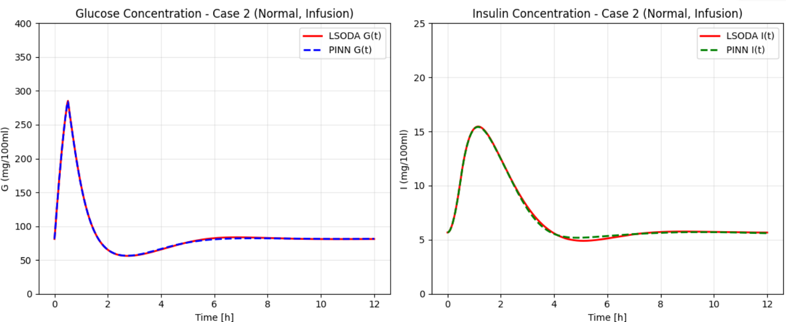
  
   <hr>
          
    <hr>
   
   <hr>
</div>

---

## 📂 Output of methods

The notebook provides **visual plots** for each method:
- Time-series of **glucose and insulin** concentrations.
- Comparison between methods.

<div name="Screenshots" align="center">
   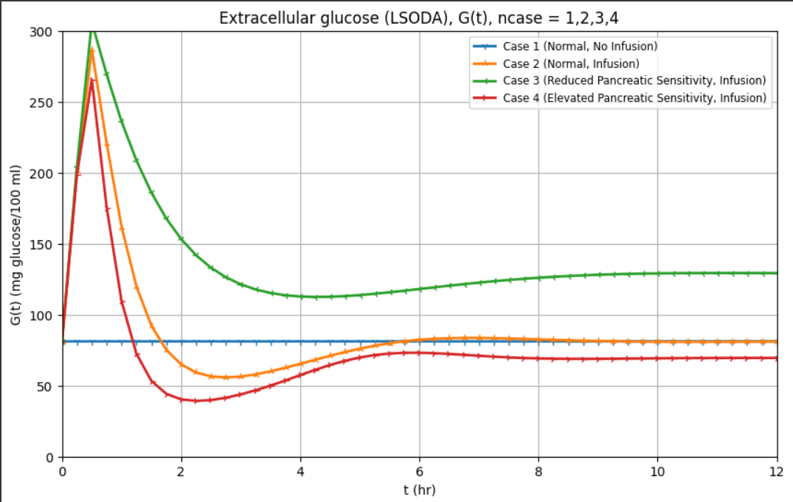
   <hr>
	
   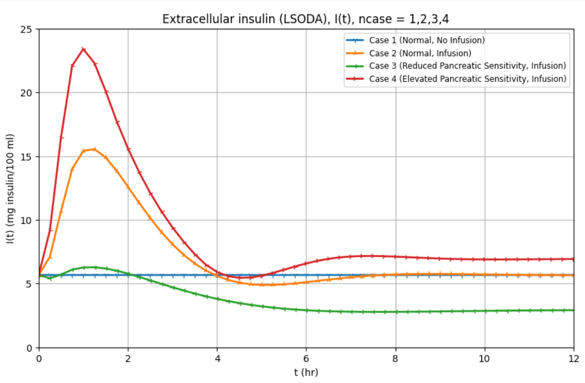
  
   <hr>
          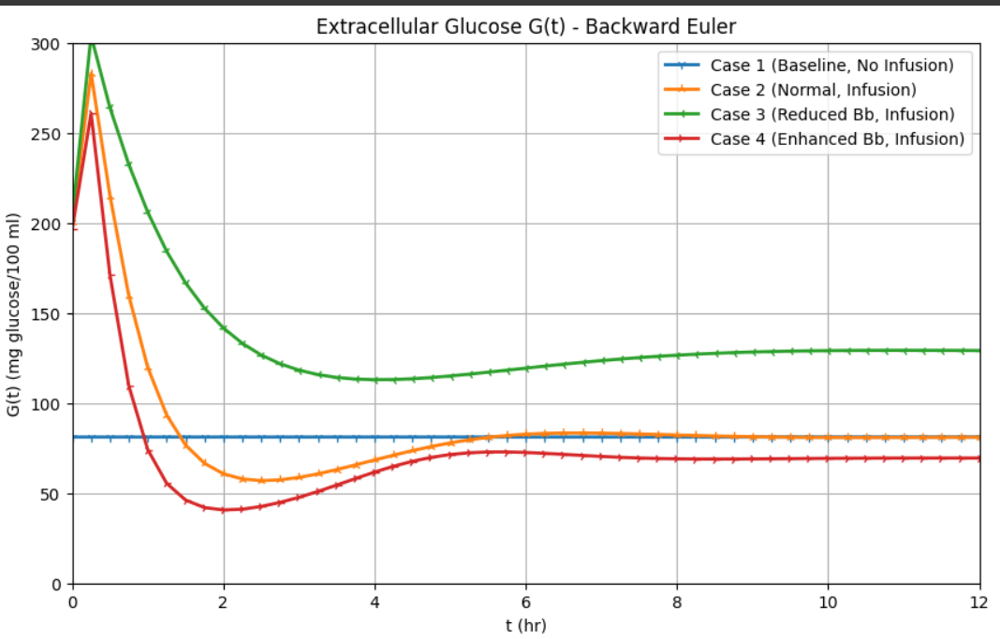
    <hr>
   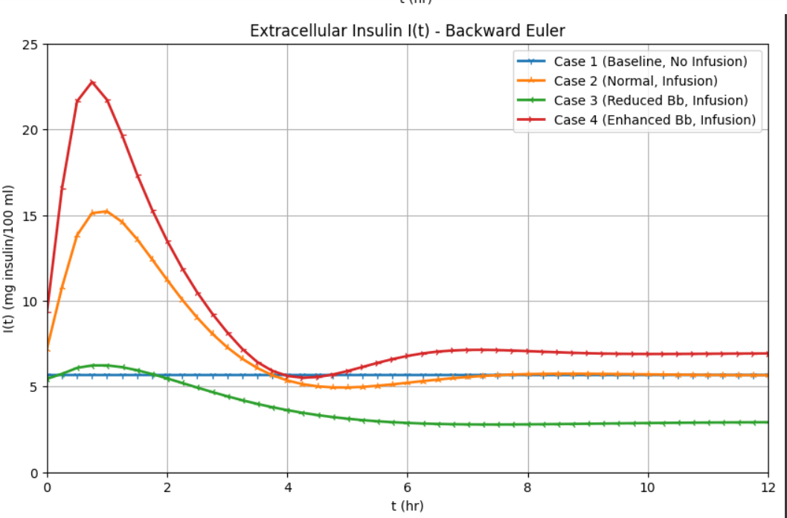
   <hr>
   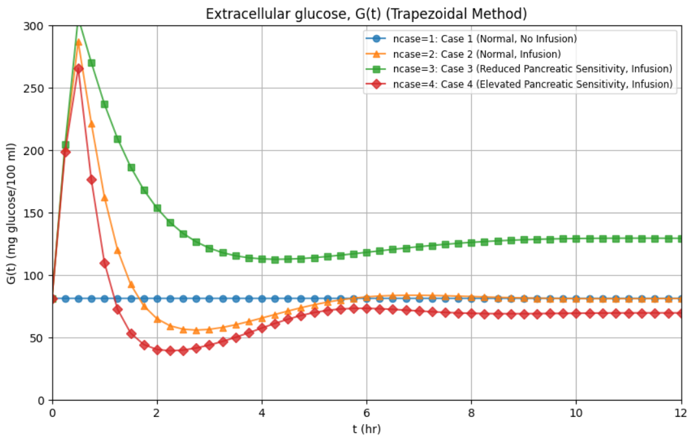
   <hr>
	
   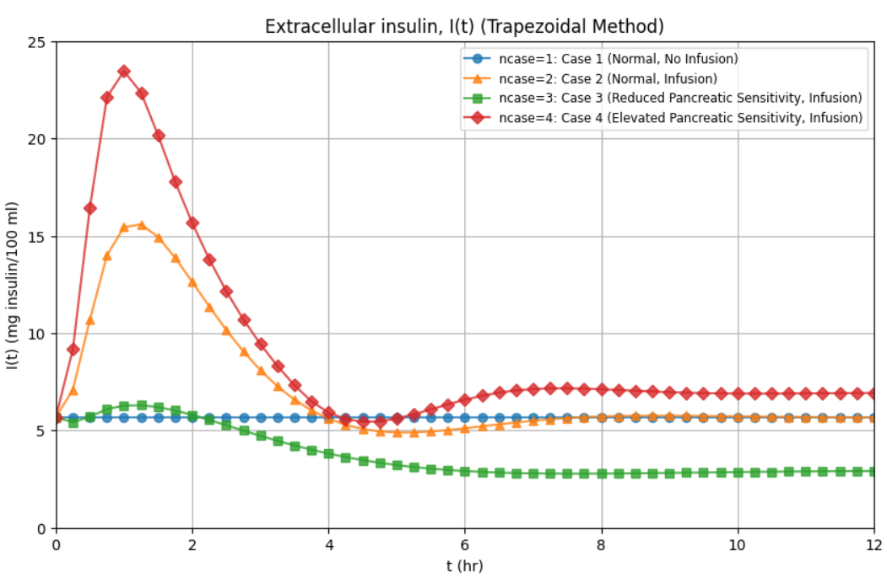
  
   <hr>
          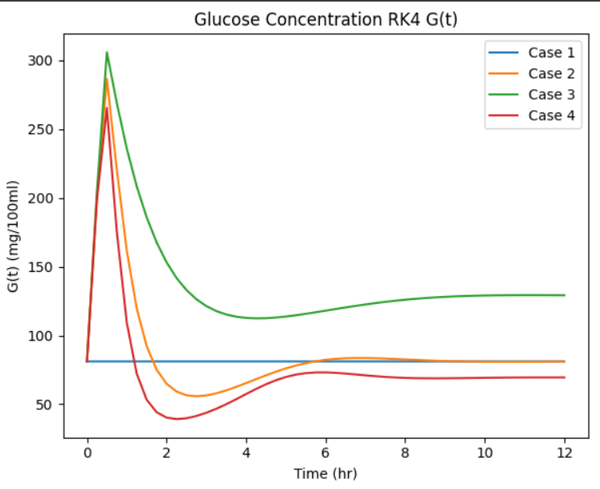
    <hr>
   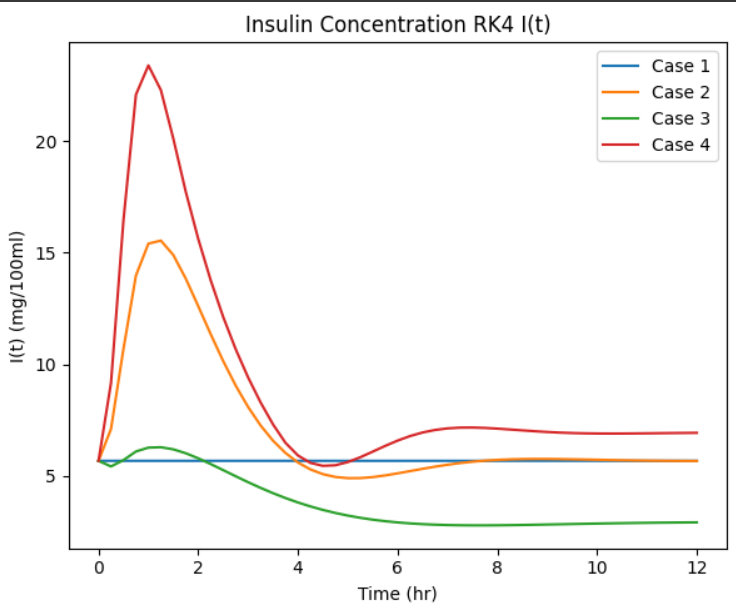
   <hr>
      <hr>
   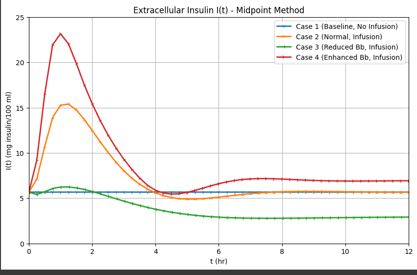
   <hr>
      <hr>
   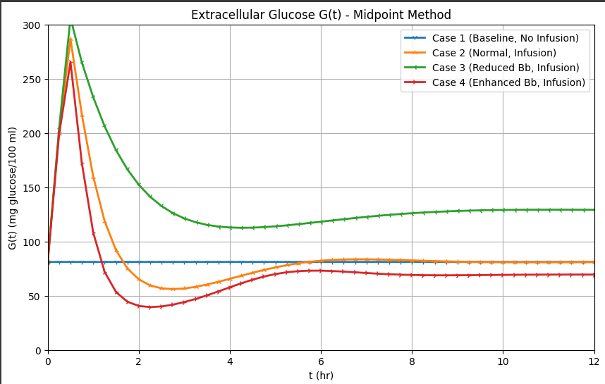
   <hr>
</div>


---
## 🧪 Citation

If you use this work in your research or learning, consider citing the original PINN paper:
> M. Raissi, P. Perdikaris, G. E. Karniadakis, *Physics-informed neural networks: A deep learning framework for solving forward and inverse problems involving nonlinear partial differential equations*. JCP, 2019.

---
## Contributors <a name = "contributors"></a>
<table align="center">
  <tr>
    <td align="center">
      <a href="https://github.com/hamdy-cufe-eng" target="_blank">
        <br />
        <sub><b>Hamdy Ahmed</b></sub>
      </a>
    </td>
    <td align="center">
      <a href="https://github.com/Karim-Mohamed-Elsayed" target="_blank">
        <br />
        <sub><b>Karim Mohamed</b></sub>
      </a>
    </td>
    <td align="center">
      <a href="https://github.com/David-Amir-18" target="_blank">
        <br />
        <sub><b>David Amir</b></sub>
      </a>
    </td>
    <td align="center">
      <a href="https://github.com/KareemFareed06" target="_blank">
        <br />
        <sub><b>Kareem Fareed</b></sub>
      </a>
    </td>
    <td align="center">
      <a href="https://github.com/Jananour00" target="_blank">
        <br />
        <sub><b>Jana Nour</b></sub>
      </a>
    </td>
  </tr>
  <tr>
    <td align="center">
      <a href="https://github.com/MohamedSayed-2005" target="_blank">
        <br />
        <sub><b>Mohamed Sayed</b></sub>
      </a>
    </td>
    <td align="center">
      <a href="https://github.com/Jiro75" target="_blank">
        <br />
        <sub><b>Mostafa Hany</b></sub>
      </a>
    </td>
    <td align="center">
      <a href="https://github.com/Ibrahim-Abdelqader" target="_blank">
        <br />
        <sub><b>Ibrahim Abdelqader</b></sub>
      </a>
    </td>
    <td align="center">
      <a href="https://github.com/SulaimanAlfozan" target="_blank">
        <br />
        <sub><b>Sulaiman</b></sub>
      </a>
    </td>
    <td align="center">
      <a href="https://github.com/OmegasHyper" target="_blank">
        <br />
        <sub><b>Mohamed Abdelrazek</b></sub>
      </a>
    </td>
  </tr>
  <tr>
    <td align="center">
      <a href="https://github.com/NARDEEN-UX" target="_blank">
        <br />
        <sub><b>Nardeen Ezz</b></sub>
      </a>
    </td>
  </tr>
</table>
